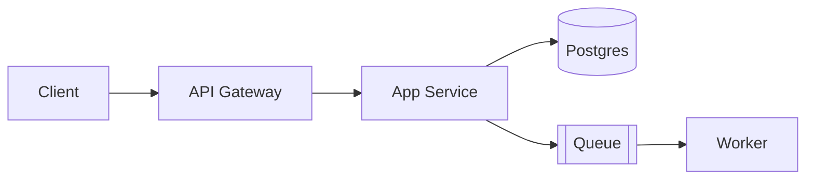

# Skill: Codebase Documentation

How to produce documentation for a repository that is accurate, navigable, and useful to both humans and agents. Pair this skill with `skills/knowledge-management/knowledge.md`, which defines *where* knowledge is stored and *when* to capture it; this skill defines *how* to write it well.

---

## Documentation Principles

- **Write for the reader who knows nothing** — the next engineer (or agent) has zero context.
- **Lead with the conclusion** — the first sentence must answer "what is this and why does it exist".
- **Stay close to the code** — live in the repository, next to what they describe, never in a disconnected wiki.
- **Show, don't dump** — short examples and diagrams beat transcribed source code.
- **Cite locations** — use `path/to/file.ext:12` so readers can jump straight to evidence.
- **Document the why** — the code already says *what*; documentation explains intent, constraints, and trade-offs.
- **Single source of truth** — one canonical page per topic; link instead of copying.
- **Update in the same change** — a PR that alters behaviour must update the docs it invalidates.

---

## The Documentation Pyramid

```
              ┌────────────┐
              │   ADRs     │  ← why we decided this (rare, permanent)
              └────────────┘
           ┌──────────────────┐
           │  Module Guides   │  ← how each area works (per bounded area)
           └──────────────────┘
        ┌──────────────────────────┐
        │   Architecture Map       │  ← components, flows, boundaries
        └──────────────────────────┘
     ┌──────────────────────────────────┐
     │   README + Run/Build/Test Guide  │  ← how to start (always)
     └──────────────────────────────────┘
```

Build from the bottom up. A repository with a great README and no ADRs is far more useful than the reverse.

---

## Level 1 — README

Minimum viable README:

```markdown
# <project name>

<One paragraph: what it does, who it is for, why it exists.>

## Quickstart
prerequisites → install → run → verify (the exact commands)

## Repository Map
the 5–10 important directories and what lives in each

## Configuration
required env vars / config files (names only — never values)

## Testing
how to run tests, what counts as a passing change

## Further Reading
links into docs/knowledge/, ADRs, runbooks
```

Rules: commands must be copy-pasteable and actually tested; never document a quickstart you have not run.

---

## Level 2 — Architecture Map

Capture four levels (C4), only as deep as the system needs:

1. **Context** — the system and its external actors/systems.
2. **Container** — deployable units: web, API, DB, queue.
3. **Component** — major parts inside a container.
4. **Code** — class/module structure, only for complex or unusual designs.

Keep diagrams in Mermaid next to the code:



Alongside each diagram, list: sync vs async boundaries, the protocol, and the failure behaviour when that dependency is down.

---

## Level 3 — Module Guide

One file per bounded area (`docs/knowledge/modules/<area>.md`):

```markdown
# Module: <name>

**Responsibility** — one sentence.
**Entry points** — `src/x/main.ts:1`, `src/x/router.ts:10`
**Owned data** — tables/topics this module writes.
**Depends on** — modules and external services it calls.
**Depended on by** — who calls it.

## Flow
The happy path, step by step, with `file:line` references.

## Invariants
Rules the code enforces that are not obvious from reading it.

## Tests
Where they live, how to run them, what is deliberately untested.
```

---

## Level 4 — Decision Records (ADRs)

Write an ADR whenever a decision is expensive to reverse. Template:

```markdown
# ADR-NNN: <title>

## Status: Proposed | Accepted | Superseded by ADR-MMM

## Context
The forces at play: requirements, constraints, technical reality.

## Decision
What we will do, stated unambiguously.

## Consequences
✅ benefits   ❌ costs and risks

## Alternatives Considered
Options rejected, and the one reason each was rejected.
```

Rules: ADRs are immutable once accepted — supersede, never edit history; one decision per ADR; keep them under a page.

---

## Level 5 — Operations Docs

`docs/knowledge/operations.md` (or runbooks):

- **Deploy**: the exact pipeline, manual steps if any, health checks.
- **Rollback**: how to revert, data-migration caveats.
- **Debug**: how to reproduce locally, useful log queries, dashboards.
- **Alerts**: what each alert means and its first-response action.

Write runbooks as numbered procedures that a stressed engineer can follow at 3 a.m.

---

## Onboarding Discovery Procedure

When documenting an unfamiliar repository for the first time:

1. Read `README`, manifest files (`package.json`, `pyproject.toml`, `go.mod`, `Cargo.toml`), and CI config.
2. Find the entry points: `main`, app bootstrap, HTTP server, job runner.
3. Trace one real request end-to-end (or one record through a pipeline).
4. Run the build and test commands; record what actually works.
5. List directory purpose from where files cluster, not from folder names alone.
6. Note conventions observed in code (naming, error handling, test style) — observed, not assumed.
7. Identify external dependencies: databases, queues, third-party APIs.
8. Write the docs; cite every claim with a `file:line` reference.

---

## Writing Rules

| Do | Don't |
|---|---|
| Link `src/order/service.ts:42` | Paste 60 lines of source |
| "Why: we chose X because Y" | "This function returns a value" |
| Mermaid diagram of the flow | ASCII art that drifts from reality |
| Tested quickstart commands | Command you never ran |
| One canonical page per topic | Three overlapping copies |
| Update docs in the PR that changes behaviour | "Docs to follow later" |
| Mark unknowns as *unknown* | Invent plausible-sounding detail |

---

## Keeping Documentation Alive

- **Docs are code**: they live in the repo, are reviewed in PRs, and break when stale.
- Any PR that changes behaviour, configuration, or structure must touch the affected doc.
- Reviewers reject changes where `docs/knowledge/` entries became stale.
- Periodically run the onboarding discovery procedure and reconcile — a yearly fresh-eyes pass catches drift no PR review will.

---

## Checklist: Documentation Complete

- [ ] README answers *what, why, quickstart, where things live*.
- [ ] Architecture map exists with at least a context and container diagram.
- [ ] Every bounded area has a module guide with entry points and invariants.
- [ ] Significant, hard-to-reverse decisions have ADRs.
- [ ] Run, build, and test commands are verified, not copied.
- [ ] Every claim cites `file:line` or a command result.
- [ ] No secrets, tokens, or internal-only details are documented.
- [ ] `docs/knowledge/INDEX.md` lists every document with freshness status.
